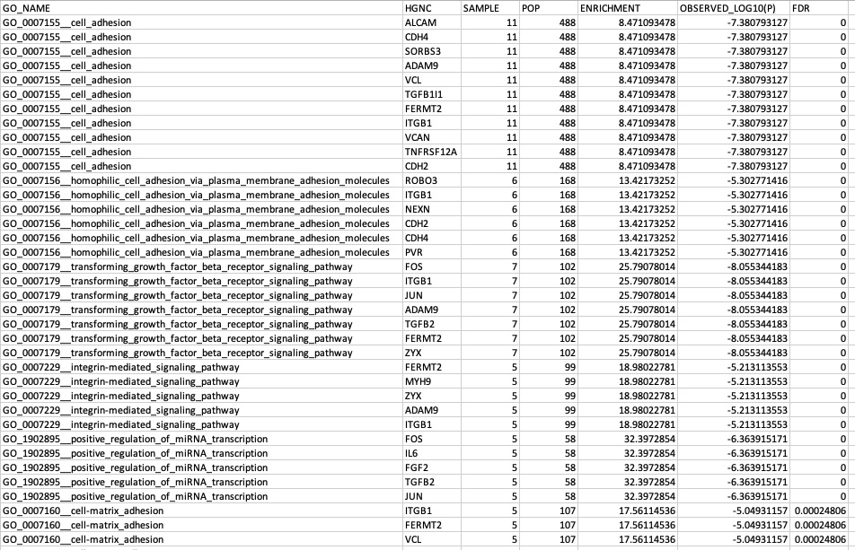
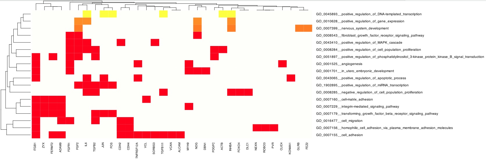
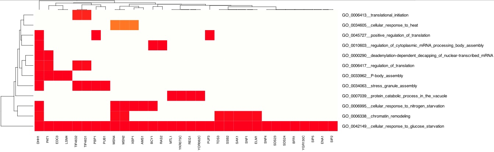

<style>
body {
text-align: justify;
font-size: 16pt;
font-family: Times;}
</style>

<p class=MsoNormal align=center style='text-align:center'><b style='mso-bidi-font-weight:
normal'><span style='font-size:16.0pt;font-family:"Times New Roman",serif;
color:red'>GoMiner: A Resource for Biological Interpretation of Human Genomic Data<o:p></o:p></span></b></p>

<p class=MsoNormal align=center style='text-align:center'><b style='mso-bidi-font-weight:
normal'><span style='font-size:16.0pt;font-family:"Times New Roman",serif'><o:p>&nbsp;</o:p></span></b></p>

<p class=MsoNormal align=center style='text-align:center'><b style='mso-bidi-font-weight:
normal'><span style='font-size:16.0pt;font-family:"Times New Roman",serif'><o:p>&nbsp;</o:p></span></b></p>

<p class=MsoNormal align=center style='text-align:center'><b style='mso-bidi-font-weight:
normal'><span style='font-size:16.0pt;font-family:"Times New Roman",serif'>Barry
Zeeberg<o:p></o:p></span></b></p>

<p class=MsoNormal align=center style='text-align:center'><b style='mso-bidi-font-weight:
normal'><span style='font-size:16.0pt;font-family:"Times New Roman",serif'>barryz2013@gmail.com<o:p></o:p></span></b></p><br>

<p class=MsoNormal style='text-align:justify'><span style='font-size:16.0pt;
font-family:"Times New Roman",serif'></p><br>

<p class=MsoNormal align=center style='text-align:center'><b style='mso-bidi-font-weight:
normal'><span style='font-size:16.0pt;font-family:"Times New Roman",serif'>Motivation<o:p></o:p></span></b></p>


My previously published paper (Zeeberg, B.R., Feng, W., Wang, G. et al. (2003) <doi:10.1186/gb-2003-4-4-r28>) includes a complete presentation of GoMiner, so I will only give a brief motivation here, and a few results to provide proof of concept for this particular implementation.

In gene-expression microarray studies, one generally obtains a list of dozens or hundreds of genes that differ in expression between samples and then asks: 'What does all of this mean biologically?' Alternatively, gene lists can be derived conceptually in addition to experimentally. For instance, one might want to analyze a group of genes known as 'housekeeping genes.'

The work of the Gene Ontology (GO) Consortium (https://geneontology.org) provides a way to address that question. GO organizes genes into hierarchical categories based on biological process, molecular function and subcellular localization. The role of GoMiner is to automate the mapping between a list of genes and GO categories, and to provide both a statistical summary and a visualization of the results.

The original paper cited above was published in 2003, and GoMiner was implemented for a number of years on a server hosted by The National Cancer Institute (NCI). More recently, it was no longer practicable for NCI to maintain and host GoMiner, and it became difficult or impossible for researchers to access this resource. As an alternative, I am hoping to provide a basic resource that a researcher can run locally, and does not require a dedicated remote server, currently with the restriction that the only species directly supported will be 'human.' Researchers who need access to other species, and who have the technical skills needed, can extend the database that I provided in my package 'minimalistGODB.'


As my attempt to provide the range of GoMiner resources, I have developed four CRAN packages that together comprise the GoMiner Suite. These include the present package 'GoMiner' and my implementation of the GO database 'minimalistGODB,' as well as two upcoming packages (expected March 2025) 'High Throughput GoMiner (HTGM)' and 'Two Dimensional High Throughput GoMiner (HTGM2D)'


<p class=MsoNormal align=center style='text-align:center'><b style='mso-bidi-font-weight:
normal'><span style='font-size:16.0pt;font-family:"Times New Roman",serif'>Human Results<o:p></o:p></span></b></p>

The list of genes that we will use here for proof of concept, referred to as 'cluster52' was derived from a published analysis of a large set of cancer cell lines (Zeeberg, B.R., Kohn, K.W., Kahn, A., Larionov, V., Weinstein, J.N., Reinhold, W., Pommier, Y. (2012) <doi/10.1371/journal.pone.0040062 >) and was subsequently the subject of intensive research (Kohn, K.W., Zeeberg, B.R, Reinhold, W.C., Sunshine, M., Luna, A., Pommier, Y. (2012) <doi/10.1371/journal.pone.0035716>) because they were associated with categories like cell adhesion, which are key to understanding metastasis. The gene list is available in data/cluster52.RData . The GO database *GOGOA3* can be obtained from my package 'minimalistGODB' or downloaded from https://github.com/barryzee/GO.

The GoMiner study was invoked by

```
l<-GoMiner("Cluster52",tempdir(),cluster52,
  GOGOA3,ONT="biological_process",enrichThresh=2,
  countThresh=5,fdrThresh=0.10,nrand=10)
```

The resulting 'gce' file is shown in Figure 1. This compares the mapping of genes in the gene list, compared with the mapping of genes in the entire database. For example, 11 of the genes in the gene list map to 'cell_adhesion', compared with 488 genes in the entire database. After normalization for the relative number of genes in the list and the database, this represents 8.47 fold enrichment. This is equivalent to a log10(p) = -7.38, which represent an immeasurably small false discovery rate (FDR). A full discussion of FDR can be found in my published paper cited above.

{width=125%}
Figure 1. gce for cluster52 genes
<br><br>

These results are most conveniently summarized graphically in a heat map (Figure 2). The color scale represents the FDR of the category, with bright red corresponding to the most significant FDR close to 0.00, and the light background color corresponding to the fdrThresh of 0.10. For this figure, the number of randomizations used for computing FDR was 10. Identical results (not shown) were found with 1000 randomizations.

The visualization is saved using the Scalable Vector Graphics (SVG) technology, which provides a web-friendly vector image format that uses mathematical formulas to define shapes and colors, allowing for crisp, scalable graphics without loss of quality, unlike pixel-based images. SVG is also more flexible than other formats in accommodating the large images that often are required for displaying the GoMiner heatmaps (without truncating the rather long category names).

<br>
{width=175%}

Figure 2. Heatmap for cluster52 genes

<br>

<p class=MsoNormal align=center style='text-align:center'><b style='mso-bidi-font-weight:
normal'><span style='font-size:16.0pt;font-family:"Times New Roman",serif'>Yeast Results<o:p></o:p></span></b></p>

To demonstrate that we are not limited to human, let's do a quick demo for yeast. This will also demonstrate that
GoMiner can be used for educational purposes in addition to research. One of the most interesting
properties of yeast is to ferment grapes. Let us pick the genes mapping to "GO_0042149__cellular_response_to_glucose_starvation". Of course, we expect to find these genes mapping to
"GO_0042149__cellular_response_to_glucose_starvation", but the real interest is to see what other biological
processes are also linked to this same set of genes (Figure 3). That is, we are using these genes as bait to fish out
additional relevant categories. We might draw the inference that some of these additional categories reflect
the broader systemic response to the organism's adaptation to glucose starvation.

```
# try out the yeast database!
load("/Users/barryzeeberg/GODB_RDATA/sgd/GOGOA3_sgd.RData")
# make sure this is in fact the database for the desired species
GOGOA3$species

# use the database to find genes mapping to an interesting category
cat<-"GO_0042149__cellular_response_to_glucose_starvation"
w<-which(GOGOA3$ontologies[["biological_process"]][,"GO_NAME"]==cat)
geneList<-GOGOA3$ontologies[["biological_process"]][w,"HGNC"]

l<-GoMiner("YEAST",tempdir(),geneList,
GOGOA3,ONT="biological_process",enrichThresh=2,
countThresh=3,fdrThresh=0.10,nrand=100)
```
<br>
{width=175%}

Figure 3. Heatmap for yeast genes and categories associated with glucose starvation